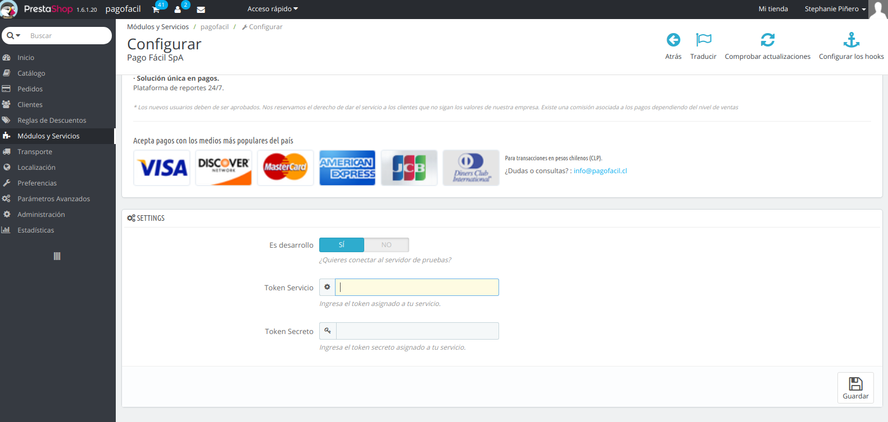

# Pago Fácil SpA

## Uso
### Requisitos

- Prestashop v1.6

### Instalación

- Subir archivo .zip mediante el Backoffice de Prestashop.
- Dejar plugin descomprimido en la carpeta "modules/pagofacil" dentro de la carpeta de instalación de Prestashop.

Una vez realizado esto se debe ir a la sección de "Módulos" y buscar Pago Fácil, luego apretar en el botón "Instalar"

### Configuración

Cuando se tenga instalado el plugin se debe hacer click el el botón "Configurar" que aparece del lado derecho del plugin. Se mostrara la siguiente vista:

- Se debe seleccionar el ambiente en el cual se desea trabajar, colocando si se desea trabajar en ambiente de desarrollo.
- Agregar el Token de Servicio y Token Secreto que le proporciona Pago Fácil
- Hacer click en el botón guardar

Una vez realizados estos pasos se puede hacer uso del método de pago con Pago Fácil
